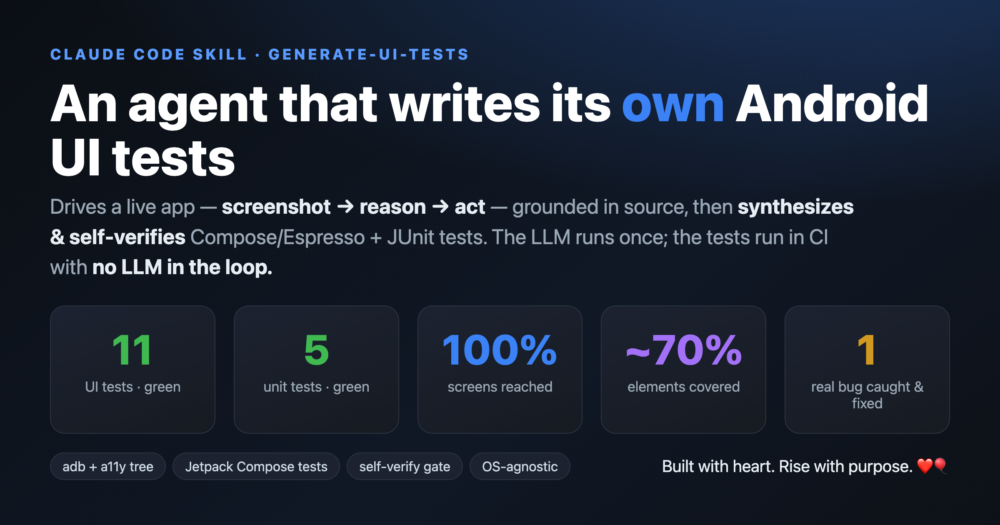
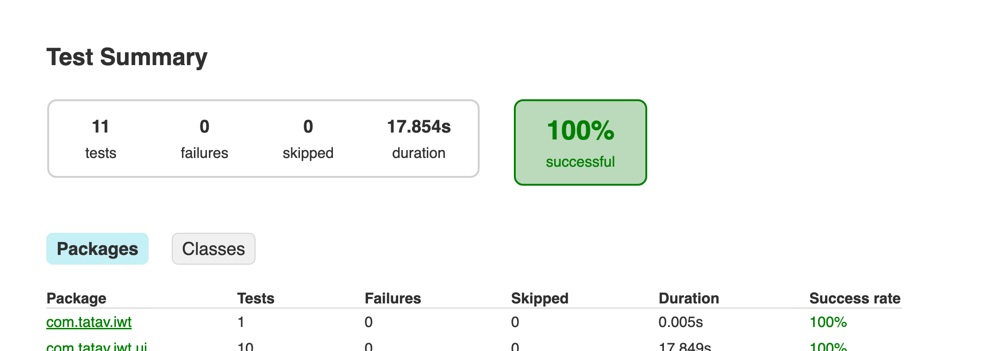

# `generate-ui-tests`



> A [Claude Code](https://claude.com/claude-code) skill. Part of
> [tatavarthitarun/claude-skills](https://github.com/tatavarthitarun/claude-skills).

**A ReAct GUI agent that authors durable Android tests by driving a real app.**

It explores a live app on a connected device — *screenshot → reason → act → repeat* — grounded in
the app's source code, then **synthesizes** Compose/Espresso UI tests + JUnit unit tests, writes them
into the repo, and **self-verifies** by compiling and running them on the device.

### The idea that makes it different
Most "AI + app testing" uses the LLM as a **manual-QA replacement** — re-exploring the app on every
run (non-deterministic, costly, can't live in CI). This skill treats the agent as a **test *author***
instead:

> The LLM runs **once**, at authoring time. The output is plain, committed test code that runs in CI
> forever — **with no LLM in the loop.** Write once, run next time.

### How it works
```
   ┌─────────────── author-time (LLM, once) ───────────────┐      run-time (CI, forever)
   │                                                        │
   │   read source ──┐                                      │
   │                 ├─► PLAN ─► ACT (adb tap/type) ─┐      │      ./gradlew connectedCheck
   │   live device ──┘     ▲                         │      │            │
   │   (screenshot +       └──── OBSERVE ◄───────────┘      │            ▼
   │    a11y tree)              (loop until dry)            │      JUnit + coverage reports
   │                              │                         │       (deterministic, no LLM)
   │                              ▼                          │
   │                  SYNTHESIZE tests ─► SELF-VERIFY (compile + run on device) ─► commit
   └────────────────────────────────────────────────────────┘
```

### Highlights
- **Two grounding sources** — source code (stable selectors, nav graph, unit-testable logic) *and*
  the live device (what actually renders, async states). Both are needed.
- **Planning + loop-until-dry** exploration driven by the source navigation graph (not random-walk).
- **Self-verify gate** — generated tests must compile and pass on-device before they're kept.
- **Auth handling** for login-walled apps (credential injection or session seeding).
- **Honest coverage report** — screens/elements reached vs. expected, with a reason for every gap.
- **OS-agnostic** — macOS / Linux / Windows.

### Proven on a real app
Run against a Jetpack Compose app on a physical Motorola device:
- ✅ **11 UI tests + 5 unit tests — all green** on-device
- 📊 **100% screen coverage**, **~70% interactive-element coverage** (measured, not implied)
- 🐞 The self-verify gate caught a real flake — a permission dialog stealing the window — and fixed it
  with a `GrantPermissionRule`, *proven* by revoking the permission and re-running green.



---

## Install
Clone into your Claude Code user skills directory:

```bash
# macOS / Linux
git clone https://github.com/tatavarthitarun/claude-skills "$HOME/.claude/skills"
```
```powershell
# Windows
git clone https://github.com/tatavarthitarun/claude-skills "$env:USERPROFILE\.claude\skills"
```
Restart Claude Code and run `/generate-ui-tests`.

> Already have skills in that folder? Clone elsewhere and copy the `generate-ui-tests/` directory in.

---

<sub>Built by [Tarun Tatavarthi](https://github.com/tatavarthitarun) — Android engineer exploring agentic AI.</sub>

<sub>**Built with heart. Rise with purpose.** ❤️🎈</sub>
